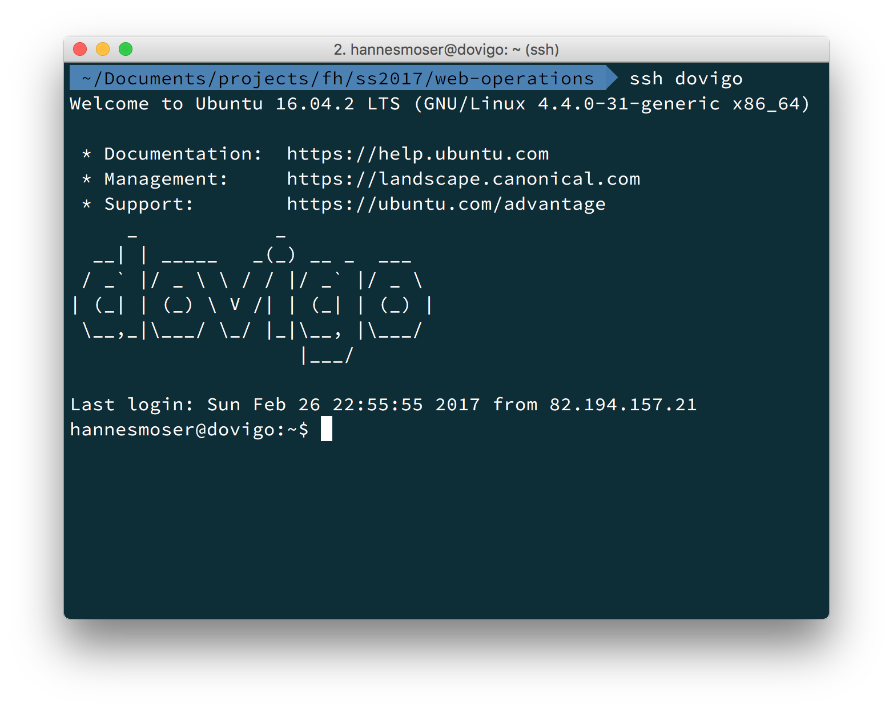

# Web Operations

> Diese Unterlagen sind als begleitendes Lehrmaterial für die ILV Web Operations im *SS2017* vorgesehen. Sie dienen als Ergänzung zu den Slides, die sie im Wiki finden.

## Lehrveranstaltungsinhalte

Sie können einen Produktions-Webserver mit virtuellen Hosts und SSL installieren und konfigurieren, kennen die Konfigurations-Dateien, Logfile, Ordner. Sie können Tools einsetzen um den Betrieb des Servers zu überwachen, und bei Ausfällen alarmiert zu werden. Sie können einen Load Balancer konfigurieren. Inhalte: UNIX, Webserver Apache und nginx, Monitoring, Load Balancer.

### Kompetenzerwerb aus dem übergeordneten Modul

Studierende können Backends für Realtime-Applikationen und Multi-User-Games entwickeln. Sie verwenden Webservices und andere APIs. Sie setzen fortgeschrittene Test-Methoden ein. Sie können die i18n Werkzeuge von Web-Frameworks nutzen um Applikationen zu entwickeln die mehrere Sprach-Varianten anbieten. Sie verwenden Caching um die Applikation zu beschleunigen. Sie kennen typische Sicherheitsprobleme von Web Applikationen, und die Unterstützung die Web Frameworks zur Vermeidung dieser Probleme anbieten. Sie können einen Produktions-Webserver installieren und konfigurieren, den Betrieb des Servers überwachen, einen Load Balancer konfigurieren.

## UNIX

Die Art von Betriebssystem für die wir uns in erster Linie interessieren, sind die unterschiedlichsten UNIX Derivate (insbesondere Linux). Das Betriebssystem finden wir auf vielen eigenen Servern, sowohl auch in der Cloud ([Amazon AWS - EC2](https://aws.amazon.com/de/)).

Nach diesem Kapitel, sollten sie die wichtigsten Aufgaben für die Inbetriebnahme eines UNIX basierten Servers, selbstständig meistern können.

### Authentication

Eine der Aufgaben die einen bei Betrieb und Instandhaltung von Servern immer wieder begegnen, ist der Zugriff auf den Server. Für diesen Zweck existiert ein sehr mächtiges Werkzeug namens *SSH* ([Secure Shell](https://de.wikipedia.org/wiki/Secure_Shell)).

Wir wollen folgendes Ziel erreichen, eine sichere Verbindung zum Server aufbauen, eine *SSH Config* erstellen und *Public Key Crypto* für die Authentication verwenden.

**Example**
```
ssh myserver
```

Jeder Server ist via IP Adresse und eventuell mittels DNS erreichbar. Wir müssen also diese Information in Erfahrung bringen. Weiters müssen wir wissen, mit welchem Nutzer wir uns auf dem Server anmelden und welches Verfahren zur Authentication genutzt wird (etwa ein Passwort).

**Example: User**
```bash
ssh hannesmoser@myserver.com
```

In einer üblichen Konfiguration wird nun die Eingabe des Passworts erwartet. Ist alles gelungen, wird nun eine Session am Server geöffnet.



In der Standardkonfiguration kann es sehr mühsam sein, den Server zu verwalten. Etwa ist es erforderlich für jede neue Verbindung, das Passwort einzugeben. Weiters muss der Nutzer angegeben werden und die IP Adresse oder der Hostname in voller Länge bekannt sein. Dafür gibt es eine nette Lösung.

#### SSH Config

Im `.ssh` Verzeichnis eures Nutzers kann eine *config* Datei angelegt werden. In dieser Datei können alle Einstellungen für eine SSH Verbindung überschrieben werden.

**Example**
```bash
Host myserver
HostName 193.170.119.50
User hannesmoser
```

Die erstellte Konfiguration bewirkt folgendes. Man kann nun eine SSH Verbindung zu `myserver` aufbauen. Tut man dies, wird automatisch die IP Adresse *193.170.119.50* mit dem Nutzer *hannesmoser* verwendet.

Das bedeutet, aus folgendem Beispiel:

```bash
ssh hannesmoser@193.170.119.50
```

wird

```bash
ssh myserver
```

Das ist schon um einiges einfacher, obwohl wir immer noch jedes Mal ein Passwort eingeben müssen. Diese Problematik lässt sich mit der Anwendung von *Public Key Crypto* angehen.

#### Public Key Crypto

Wie das prinzipiell funktioniert haben wir bereits gelernt als wir angefangen haben mit *git* zu arbeiten. Hier gibt es zur Auffrischung nochmals den [Link](http://web-development.github.io/git/public-private-key/).

Uns interessiert hier vor allem die Konfiguration des Servers. Wir wollen es bestimmten Benutzer erlauben, sich ohne Passwort am Server via SSH anzumelden. Wenn wir bereits ein Schlüsselpaar erstellt haben, können wir den nächsten Schritt überspringen.

##### Schlüsselpaar anlegen

```bash
ssh-keygen -t rsa -C "jdoe.mmt-b2017@fh-salzburg.ac.at"
```

Wenn alles gut läuft, findet man nun zwei neue Dateien in `~/.ssh`. Eine enthält den privaten Schlüssel `id_rsa` und die zweite den öffentlichen `id_rsa.pub`. Nur zur Erinnerung, wir arbeiten immer nur mit dem öffentlichen Schlüssel. Wie für ein Passwort gilt, der private Schlüssel wird niemals geteilt.

##### Authorized Keys

Um Zugriff mittels eines bestimmten Benutzers auf den Server zu bekommen, müssen wir den *öffentlichen Schlüssel* jenen Nutzers auf den Server kopieren.

**Example**
```bash
cat ~/.ssh/id_rsa.pub # copy output
# Mac OS only
pbcopy < ~/.ssh/id_rsa.pub # copies to clipboard
```

Now sign in to your server via a SSH shell.

```bash
ssh myserver
```

Finde nun das SSH Verzeichnis `cd ~/.ssh` und erstelle eine neue Datei mit dem Namen `authorized_keys` (nutze das *touch* Kommando dafür). Anschließend muss die Datei geöffnet `vim ~/.ssh/authorized_keys` und der Inhalt des *öffentlichen Schlüssel* eingefügt werden. Falls der Login nicht funktioniert, ein häufiger Fehler sind unnötige Zeilenumbrüche. Überprüft das, bevor ihr verzweifelt.

### Pakete - Installation & Update


### File Permissions

Eines der Dinge, über die man immer wieder stolpert, sind korrekte Berechtigungen für Dateien und Ordner. Diese Berechtigungen entscheiden was man am Server lesen, schreiben oder sogar ausführen darf. Es ist äußerst hilfreich, wenn man dafür auch ein paar Terminal Kommandos auf Lager hat.

**Example**
```bash
chmod +x run.sh
```

Obiges Kommando sorgt dafür, dass wir die Datei *run.sh* ausführen können. Die Endung *sh* werden wir noch öfter sehen. Eine solche Datei beinhaltet meist ein sogenanntes [Shell script](https://en.wikipedia.org/wiki/Shell_script).

**Example**
```bash
#!/usr/bin/env sh
chmod -R o+rwX /
```

**Achtung:** Es gilt: man sollte immer genau wissen was das *Shell script* macht. In diesem Fall würde es *allen Nutzern* erlaubt werden, in jedes Verzeichnis und in jede Datei auf dem gesamten System zu schreiben (das wollen wir nicht!) und zu lesen.

In beiden obigen Beispielen kommt eine Syntax für Berechtigungen zum Einsatz die auf den ersten Blick etwas verwirrend sein kann. Versuchen wir nun das Mysterium zu lösen.

Alle Zeichen die wir verwenden haben eine genaue Bedeutung und auch die Groß- bzw. Kleinschreibung kann eine Auswirkung haben. Weiters verwenden wir ein Kommando namens *chmod* um die Berechtigungen zu setzen bzw. zu verändern. Mehr Informationen zu diesem Kommando finden man in der *man* page.

```
man chmod
```

```
CHMOD(1)                  BSD General Commands Manual                 CHMOD(1)

NAME
     chmod -- change file modes or Access Control Lists

SYNOPSIS
     chmod [-fv] [-R [-H | -L | -P]] mode file ...
     chmod [-fv] [-R [-H | -L | -P]] [-a | +a | =a] ACE file ...
     chmod [-fhv] [-R [-H | -L | -P]] [-E] file ...
     chmod [-fhv] [-R [-H | -L | -P]] [-C] file ...
     chmod [-fhv] [-R [-H | -L | -P]] [-N] file ...

DESCRIPTION
     The chmod utility modifies the file mode bits of the listed files as specified
     by the mode operand. It may also be used to modify the Access Control Lists
     (ACLs) associated with the listed files.

     The generic options are as follows:

     -f      Do not display a diagnostic message if chmod could not modify the mode
             for file.
             …
```

Zu allererst nochmals ein kurzer Ausflug zur Notwendigkeit von Berechtigungen. Warum müssen wir überhaupt Berechtigungen setzen? Wäre es nicht viel einfacher einfach allen Nutzern, alles zu erlauben? Denke dabei an folgendes Szenario: 

Dein Webserver hostet eine Wordpress Website. Diese Website erlaubt es ihren Nutzern z.B. Bilder hochzuladen. In einer Welt ohne Probleme würden wir immer noch keine Berechtigungen benötigen, allerdings passiert jetzt etwas völlig Unerwartetes.
Die Website hat eine Sicherheitslücke und ein potentieller Angreifer kann eine beliebige ausführbare Datei hochladen. Diese Datei wird erst gefährlich wenn es dem Angreifer gelingt, der Datei die Rechte zu geben die sie zur Ausführung benötigt (e.g. `+x`). Was auch immer in diese Datei liegt, es ist nun möglich diese auszuführen. Der direkte Zugriff auf den Server ist dabei nicht zwingend erforderlich. 

Weiters wollen wir natürlich nicht allen Nutzern erlauben alle Informationen auf einem System einzusehen (wie etwa geheime Passwörter und Verbindungsdaten zum Payment Provider).

Nun wollen wir uns jedoch ein paar praktische Beispiele ansehen. Dazu müssen wir uns ansehen wie das Kommando und die einzelnen Optionen zusammenspielen. Prinzipiell kennen wir zwei unterschiedliche Notationen. Eine [symbolische](https://en.wikipedia.org/wiki/File_system_permissions#Symbolic_notation) und eine [numerische](https://en.wikipedia.org/wiki/File_system_permissions#Numeric_notation).

#### Symbolic Notation

Diese Notation ist jene auf die man stolpert wenn man in der Kommandozeile `ls -l` eintippt.

```
~$ ls -l
-rw-r--r--@ 1 hannesmoser  staff  5947 Feb 26 22:11 book.md
```

An der Ausgabe kann man erkennen, dass folgende Berechtigungen gesetzt sind:

* Die Datei `book.md` darf von dem Besitzer gelesen und geschrieben werden
* Die Datei `book.md` darf von der Gruppe und allen anderen Nutzern gelesen werden

Nun wollen wir die Berechtigungen der Datei wie folgt ändern. Außer dem Nutzer darf niemand mehr lesen und der Nutzer darf nicht mehr schreiben.

**Entferne Leserechte für die Gruppe und andere Nutzer**
```bash
chmod go-r book.md
```

**Entferne Schreibrechte für Benutzer**
```bash
chmod u-w book.md
```

Die Rechte sollten nun wie folgt aussehen:

```bash
~$ ls -l
-r--------@ 1 hannesmoser  staff  5947 Feb 26 22:11 book.md
```

In unserem einfachen Beispiel kommt bereits einiges an verwirrenden Zeichen vor. Wir können die Befehle jedoch noch weiter kombinieren. Aus zwei Eingaben könnten wir auch eine einzelne machen.

```bash
chmod u-w,go-r book.md
```

Folgende Schlüsse können aus den Beispielen gezogen werden. An erster Stelle, wird immer die Berechtigungsklasse angegeben (u → Owner, g → Gruppe, o → andere Nutzer). Klassen können auch kombiniert werden, in dem man sie aneinanderreiht (ugo → alle Kombinationen).  
Weiters definiert das nächste Zeichen ob eine Berechtigung hinzugefügt oder entfernt werden soll. Ein `+` fügt eine Berechtigung hinzu und `-` bewirkt das Gegenteil. Berechtigungen können wie Klassen aneinandergereiht werden.
Mögliche Berechtigungen sind `r` lesen, `w` schreiben und `x` ausführen.

Hier kommt eine weitere Eigenart zum Vorschein. Um einen Ordner zu öffnen, reicht es nicht die Leseberechtigung zu setzen, sondern der Ordner benötigt die Rechte für *Ausführen*. Man könnte etwa `chmod +x ./directory -R` setzen und es wäre dem genüge getan. Allerdings gibt es einen Nebeneffekt dieses Kommandos. Damit würden alle Dateien in diesem Verzeichnis (und allen Unterverzeichnissen) ausführbar gemacht werden. Dies kann verhindert werden indem man anstatt eines `x` ein `X` schreibt. Ein großes `X` wird nur auf die Ordner und alle Unterordner angewandt.

**Das korrekte Kommando**
```bash
chmod -R +X ./directory
```

#### Numeric Notation

T.B.D.

#### Aufgabe

Lade eine statische Website auf deinen Server hoch und setze die Berechtigungen so, dass der Webserver alles lesen, jedoch nichts schreiben darf.

#### Lösung

```
rsync -r ./local-website/* user@myserver:/var/www/website
ssh myserver
cd /var/www/website
chown -R www-data:www-data .
chmod -R ugo-rwx,ug+rX .
```