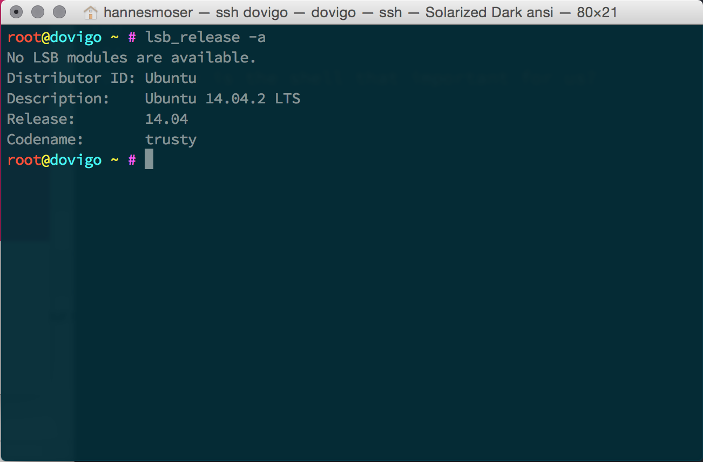

footer: Web Operations — Hannes Moser 2017 — @eliias
slidenumbers: true
autoscale: true
build-lists: true

# Web Operations

---

# Literature

Web Operations — John Allspaw & Jesse Robbins[^1]
[Apache Webserver](http://httpd.apache.org/docs/2.4/)
[nginx Webserver](http://nginx.org/en/docs/)
[Phusion Passenger](https://www.phusionpassenger.com/documentation_and_support)
[Script & Snippets](https://github.com/multimediatechnology/web-operations)

[^1]: ISBN: 978-1-449-37744-1

---

# CLI
## The *not so* old school user interface

---



---

# Why is the CLI so important to us?

---

### It is the ONLY interface to most of our servers!

---

# Common CLI tasks

- Login to servers
- Enable firewall
- Setup, start & stop services
- Set file and directory permissions
- Install software

---

# Important commands

---

### man → __manual__

---

### man man → __opens the man manual__

---

### man ls → __opens the ls manual__

---

### cd → __change directory__

---

### cd .. → __goto parent dir__

---

### cd . → __goto current dir__

---

### cd ./sub → __goto subdirectory__

---

### cd ../sibling <br>→ __goto parent and switch to sibling__

---

### cd ../../ → __go 2 steps up__

---

### pwd → __print name of working directory__

---

### pwd → */var/www/html*

---

### ls → __list__

---

### ls -l → __list in long format__

---

### ls -a → __include hidden files and dirs__

---

### ls -la → __combine flags__

---

### rm → __remove files or directories__

---

### rm -r <br>→ __remove directories and their contents recursively__

---

### rm -f <br>→ __ignore nonexistent files and arguments, never prompt__

---

### chown → __change ownership__

---

### chown www-data:www-data <br>→ __group and user__

---

### chown www-data → __change user only__

---

### chown :www-data <br>→ __change group only__

---

### chown www-data: → __change both__

---

### chmod → __change file mode__

---

### chmod 777 file → __octal-mode__

---

### chmod a+x file → __symbolic-mode__

---

### chmod ugo-rwx file → __reset everything__

---

### tail → __output the last part__

---

### tail file → __output the last part of file__

---

### tail -f file <br>→ __output the last part of file and follow__

---

### exit <br>→ __cause normal process termination__

---

### exit <br>→ __close your terminal session__

---

### Ctrl+c → __kill process with SIGINT__

---

### Ctrl+z <br>→ __suspend process with SIGSTOP__

---

### fg <br>→ __bring suspended process back to foreground__

---

### bg <br>→ __run process in background__

---

### jobs <br>→ __list suspended commands__

---

### kill %1 <br>→ __kill command by index__

---

### clear → __clear the terminal screen__

---

### vi → __start vi editor__

---

### vim → __start vim editor__

---

### nano → __start nano editor__

---

### pico → __start pico editor__

---

### which → __locate a command__

---

### which node <br>→ */usr/local/nvm/versions/io.js/v1.7.1/bin/node*

---

### service <br>→ __run a System V init script__

---

# Package Manager

### LINUX

[aptitude](https://wiki.debian.org/Aptitude) & [dpkg](https://www.debian.org/doc/manuals/debian-faq/ch-pkgtools.en.html)
[yum](http://yum.baseurl.org/) & [rpm](http://www.rpm.org/)

---

# Apache Webserver
### Configuration

---

# Apache Webserver

```bash
cd /etc/apache2
ls -l
```

---

# Apache Webserver

```bash
-rw-r--r-- 1 root root  7115 Jan  7  2014 apache2.conf
drwxr-xr-x 2 root root  4096 Mar 15 21:35 conf-available
drwxr-xr-x 2 root root  4096 Oct 28  2013 conf.d
drwxr-xr-x 2 root root  4096 Jan 23 15:15 conf-enabled
-rw-r--r-- 1 root root  1782 Jul 20  2013 envvars
-rw-r--r-- 1 root root 31063 Jul 16  2012 magic
drwxr-xr-x 2 root root 12288 Apr 25 15:37 mods-available
drwxr-xr-x 2 root root  4096 Aug  6  2014 mods-enabled
-rw-r--r-- 1 root root   357 Sep 28  2014 ports.conf
drwxr-xr-x 2 root root  4096 Apr 25 18:00 sites-available
drwxr-xr-x 2 root root  4096 Feb  2 22:41 sites-enabled
drwxrwx--- 2 root root  4096 Feb  2 22:33 ssl
```

---

# Apache Webserver

```bash
cd ./sites-available
touch fh.hannes-moser.at.conf
vim fh.hannes-moser.at.conf
```

---

# Apache Webserver

```
<VirtualHost *:80>
	…
</VirtualHost>
```

—

# Apache Webserver

```xml
ServerAdmin hannes.moser@fh-salzburg.ac.at
ServerName fh.hannes-moser.at
ServerAlias www.fh-hannes-moser.at

DocumentRoot /home/deploy/projects

<Directory />
  AllowOverride All
  Require all granted
  Allow from all
</Directory>
```

---

# Apache Webserver

```bash
a2ensite fh.hannes-moser.at
```

---

# Apache Webserver

```bash
a2enmod deflate
a2enmod rewrite
a2enmod ssl
```

---

# Apache Webserver

```bash
service apache2 restart
```

—

# Apache Webserver

Install PHP5 as module

```bash
apt-get install php5 libapache2-mod-php5
```

—

# Apache Webserver

Enable module

```
a2enmod php5
```

—

# Apache Webserver

Load

```
service apache2 restart
```

---

# Apache Webserver

```bash
service apache2 reload
```

---

# Apache Webserver

```bash
service apache2 status
service apache2 start
service apache2 stop
```

---

# nginx

> nginx [engine x] is an HTTP and reverse proxy server, a mail proxy server, and a generic TCP/UDP proxy server, originally written by Igor Sysoev.
-- http://nginx.org/en/

---

# nginx

- Able to handle many concurrent requets → event driven architecture (the [reactor pattern](https://en.wikipedia.org/wiki/Reactor_pattern))
- Popular and widely adopted (Netflix, …)
- Superfast for static content
- In general: a more modern web-server

---

# nginx Configuration

```
server {
  listen *:80;
  server_name fh.hannes-moser.at;

  root /var/www/cms;
  index index.html;
}
```

---

# nginx as Reverse Proxy


https://en.wikipedia.org/wiki/Reverse_proxy

---

# nginx as Reverse Proxy

```
location / {
  proxy_pass http://localhost:8080;
}
```

---

# nginx upstream

```
upstream clustar-api {
  server localhost:8443;
  server localhost:8444 backup;
}
```

```
location / {
  proxy_pass https://clustar-api;
```

---

# Create a System V script

```bash
cp /etc/init.d/skeleton /etc/init.d/myinitv
vim /etc/init.d/myinitv
```

```bash
#! /bin/sh
…
# PATH should only include /usr/* if it runs after the mountnfs.sh script
PATH=/sbin:/usr/sbin:/bin:/usr/bin
DESC="Description of the service"
NAME=daemonexecutablename
DAEMON=/usr/sbin/$NAME
DAEMON_ARGS="--options args"
PIDFILE=/var/run/$NAME.pid
SCRIPTNAME=/etc/init.d/$NAME
…
```

---

# Create a System V script
### You can also use upstart

[http://upstart.ubuntu.com/getting-started.html](http://upstart.ubuntu.com/getting-started.html)

but…

---

# Create a System V script
### It is deprecated in favor of

[systemd](http://www.freedesktop.org/wiki/Software/systemd/)

---

# Uncomplicated Firewall – UFW

```bash
ufw -h
```

---

# Uncomplicated Firewall – UFW

```bash
ufw enable
```

---

# Uncomplicated Firewall – UFW

```bash
ufw allow 5412
```

```bash
To                         Action      From
--                         ------      ----
5412                       ALLOW       Anywhere
5412 (v6)                  ALLOW       Anywhere (v6)
```

---

# Uncomplicated Firewall – UFW

```bash
ufw allow https
```

```bash
To                         Action      From
--                         ------      ----
443                        ALLOW       Anywhere
443 (v6)                   ALLOW       Anywhere (v6)
```

---

# Uncomplicated Firewall – UFW

```bash
ufw allow from 82.194.157.21
```

```bash
To                         Action      From
--                         ------      ----
Anywhere                   ALLOW       82.194.157.21
```

---

# Uncomplicated Firewall – UFW

```bash
ufw status
```

```bash
Status: active

To                         Action      From
--                         ------      ----
5412                       ALLOW       Anywhere
80                         ALLOW       Anywhere
443                        ALLOW       Anywhere
8080                       ALLOW       Anywhere
8443                       ALLOW       Anywhere
Anywhere                   ALLOW       82.194.157.21
5412 (v6)                  ALLOW       Anywhere (v6)
80 (v6)                    ALLOW       Anywhere (v6)
443 (v6)                   ALLOW       Anywhere (v6)
8080 (v6)                  ALLOW       Anywhere (v6)
8443 (v6)                  ALLOW       Anywhere (v6)
```
